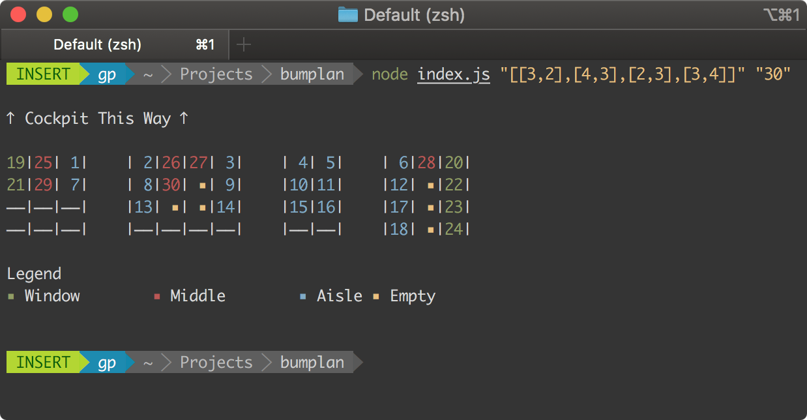

# bumplan

[](LICENSE)

A simple program that finds the seating arrangement for passengers for a given custom airplane seat layout.



<small> 📣 Note that this project was purpose-built for a coding challenge (see [problem statement](PROBLEM-STATEMENT.md)).</small>

### 🛠️ Setup

Before you run this app, make sure you have [Node.js](https://nodejs.org/en/) installed. [`yarn`](https://yarnpkg.com/lang/en/docs/install) is recommended, but can be used interchangeably with `npm`.

```bash
git clone https://github.com/paambaati/bumplan
cd bumplan
yarn install && yarn build
```

#### 👩🏻‍💻 Usage
```bash
yarn start "<seat_layout>" "<passengers_count>"
```

#### 🧪 Tests & Coverage
```bash
yarn run coverage
```

## 🧩 Design

1. The program first builds a "mapping" for the given layout (see [`buildSeatMapping()`](https://github.com/paambaati/bumplan/blob/d03e5c703f7176701140f1565d43a1fa699ac98c/index.ts#L29-L71)). Essentially, the input 2D array is flattened and a lookup table is built, along with the seat types.

    For example, for the layout —

    ```json
    [[1, 2], [3, 2]]
    ```

    The mapping built is —

    ```json
    {
        '0_0_0': 'W',
        '1_0_0': 'A',
        '1_1_0': 'M',
        '1_2_0': 'W',
        '0_0_1': 'W',
        '1_0_1': 'A',
        '1_1_1': 'M',
        '1_2_1': 'W'
    }
    ```

2. The mapping is then used to filter by seat types first and then iterated over to assign passenger number (see [`assignSeats()`](https://github.com/paambaati/bumplan/blob/d03e5c703f7176701140f1565d43a1fa699ac98c/index.ts#L77-L90)). As a nice bonus, the method will also optionally take a priority list, so it will be easier to alter the seating rules in the future.

3. The seat assignment is then printed on the screen (see [`printSeatAssignments()`](https://github.com/paambaati/bumplan/blob/d03e5c703f7176701140f1565d43a1fa699ac98c/index.ts#L92-L125)). It uses the super-lightweight [`colorette`](https://www.npmjs.com/package/colorette) to print in colors to quickly distinguish the seat types.
